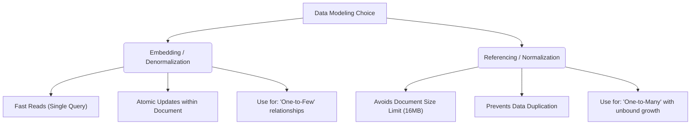

# MongoDB & Node.js Driver Key Takeaways

This document outlines core concepts, architectural patterns, and driver-specific gotchas encountered while working with MongoDB and Node.js.

---

## 1. Connection Caching & Reuse Pattern (Singleton Model)

In Node.js, establishing a database connection is an expensive operation involving TCP handshakes, authentication, and pool initialization. Recreating connections on every query or file execution can lead to socket exhaustion and performance degradation.

### The Singleton Implementation
In [db.js](file:///Users/rikutomikado/dev/git/study-mongo/db.js), we cache the client and DB instance so that subsequent calls to `connectToDatabase()` return the existing connection immediately:

```javascript
let client;
let db;

async function connectToDatabase() {
    // 1. If connection already exists, return it immediately
    if (db) return db;

    try {
        // 2. Establish connection if calling for the first time
        client = new MongoClient(uri);
        await client.connect();
        db = client.db(dbName);
        console.log('Connected to MongoDB successfully');
        
        // 3. Return the newly created db instance (Crucial!)
        return db; 
    } catch (error) {
        console.error('Error connecting to MongoDB:', error);
        process.exit(1);
    }
}
```

> [!IMPORTANT]
> **Gotcha:** If you assign a global variable like `db = client.db(dbName)` but forget to `return db;` on the connection path, helper methods importing this function will receive `undefined` on the first call, resulting in `TypeError: Cannot read properties of undefined (reading 'collection')`.

---

## 2. MongoDB Driver Gotcha: `insertMany` Return Types

In modern versions of the official `mongodb` Node.js driver (v4.x through v7.x), the return object structure for insertion operations has changed.

### The Issue
When calling `collection.insertMany([...])`, the driver returns an `InsertManyResult` object. Developers often assume that `insertedIds` is a standard JavaScript array of `ObjectId`s. However, it is actually a **dictionary/object** where the keys are indices and the values are `ObjectId`s:

```json
{
  "acknowledged": true,
  "insertedCount": 3,
  "insertedIds": {
    "0": "6a3799c4af54ff01650dd19e",
    "1": "6a3799c4af54ff01650dd19f",
    "2": "6a3799c4af54ff01650dd1a0"
  }
}
```

### The Solution
Calling `.join()` directly on `insertedIds` throws `TypeError: result.insertedIds.join is not a function`. To extract and join the list of generated IDs, extract the values first using `Object.values()`:

```javascript
const result = await collection.insertMany([...]);

// Convert the dictionary values into an array
const idsString = Object.values(result.insertedIds).join(', ');
console.log(`Added documents with _ids: ${idsString}`);
```

---

## 3. Data Modeling: Embedded vs. Referenced Documents

MongoDB is a document-oriented database, and modeling relationships is one of the most critical architectural decisions.



### A. Embedded Documents (Denormalization)
*   **Concept**: Storing related data within a single document as nested objects or arrays.
*   **Pros**: Ultra-fast read performance (no joins required) and atomicity (updating a document and its comments is atomic).
*   **Cons**: Subject to the **16MB BSON document size limit**. If arrays grow infinitely (e.g., millions of log entries under a user), the document will eventually crash.
*   **Example**: See [04_relations/1_embedded.js](file:///Users/rikutomikado/dev/git/study-mongo/04_relations/1_embedded.js).

### B. Referenced Documents & `$lookup` (Normalization)
*   **Concept**: Keeping records in separate collections and referencing them using foreign key-like fields (`ObjectId`).
*   **Pros**: Keeps individual documents small and clean; avoids duplication.
*   **Cons**: Requires multi-collection queries or aggregate pipelines (`$lookup`), which can decrease read performance.
*   **Example**: See [04_relations/2_lookup.js](file:///Users/rikutomikado/dev/git/study-mongo/04_relations/2_lookup.js).

---

## 4. Proper Resource Management with `finally`

Always ensure that database connections are properly managed when running scripts. If an error occurs during query execution, the script could crash, leaving the database connection dangling.

```javascript
try {
    const db = await connectToDatabase();
    // database operations
} finally {
    // Always closes the connection, even if the try block throws an error
    await closeDatabaseConnection();
}
```

---

## 5. The Power of Indexing

MongoDB performs a collection scan (`COLLSCAN`) if no index is available, which means it reads every single document to find matching records. 

*   By creating an index on query fields, MongoDB uses an index scan (`IXSCAN`), which operates on a sorted B-tree structure for instant lookup.
*   To create a basic single-field index:
    ```javascript
    await collection.createIndex({ name: 1 }); // 1 for ascending index
    ```
*   **Example**: See [04_relations/3_index.js](file:///Users/rikutomikado/dev/git/study-mongo/04_relations/3_index.js).
